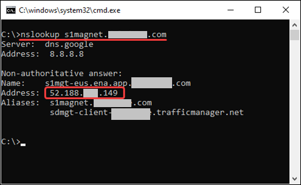

One of our customers found a lot of errors contained this text:

  -----------------------------------------------------------------------
  Error -27776: \[GENERAL_MSG_CAT_SSL_ERROR\] connect to host
  \"\<hostname\>\" failed: \[10054\] Connection reset by peer
  -----------------------------------------------------------------------

  -----------------------------------------------------------------------

 

Customer asked, what does it mean?

We answered this is performance problem on his server because connection
was dropped on his side.

Customer sad he checked logs and found nothing and asked us to check our
side.

 

Well, this is an interesting challenge - to check carefully and, after
investigation, fix the problem on our side (if we find anything) or
prove to the customer that the problem is on his side.

 

**Stage 1: preparing**

 

To start an investigation we need to collect data.

Let\'s start with the script RunTimeSettings:

 

-   There is problem with SSL, so we need to have not only an extended
    logs, but also print SSL information:

> RunTimeSettings =\> Preferences =\> General =\> Check on checkbox
> \"Print SSL information\"

 

{width="6.5in"
height="4.042361111111111in"}

 

 

I have also enabled logging.

Pay attention: I chose not \"Always\", but \"Log when error occurs...\"
and set the cache settings to 10 Kb - this means that in case of an
error, the last 10 Kb of log events will be added to the log, even if
these events do not contain errors.

I also disabled the \"Data returned by server\" checkbox, because this
option will add a bunch of extra information that I don\'t need -
because I already know that problem is at the connection stage, and this
means that the server didn\'t send anything.

 

![GENERAL Run Logic Pacing Log Think Time Additional Attributes
Miscellaneous BROWSER Browser Emulation NETWORK Speed Simulation
Streaming INTERNET PROTOCOL Content Check Proxy Preferences Download
Filters DATA FORMAT EXTENSION Chain Configuration Advanced Log Enable
logging v Log Options Send messages O Always @ Log when error occurs and
limit log cache to v Detail Level O Standard log @ Extended log
Parameter substitution o Data returned by server Advanced trace Include
environment information Print timestamp for \'Message Functions\' Log
View USE DEFAULTS O 10 Enables you to configure the amount and types of
information that are recorded in the log int
](./images/media/image2.png){width="6.5in" height="4.042361111111111in"}

 

Next, I added the following parameters for this test:

-   Delayed start - because we need to change the Load Generator
    settings before the VUsers start working.

-   Collecting VUser logs from cloud-based load generator (if the
    customer uses OPLG, you need to collect Vuser logs from on-premise
    load generator)

 

![Basic Test name Description MY Test Email a report when the test
finishes O Add emails Report Default report Run configurations License
mode Run mode VIJH v Duration v Select template Learn more Learn more G)
(D Results aggregation interval (Sec) Pause scheduling up to Add Vusers
@ Delayed start G) Exclude think time from TRT calculation (D Group
transactions @ Optimal percentile (T-Digest) Data and logs Stream errors
to Splunk Store errors Store transactions raw data Learn more Collect
Vuser logs from cloud-based load generators (D Collect Vuser logs from
on-premises load generators G)
](./images/media/image3.png){width="4.799305555555556in" height="9.0in"}

 

 

Now we can start the test.

Wait for such a window (**don\'t click anything!**)

 

![Initializing load test: My Test 100% Initializing environment 100%
Control components 0% Monitor 0% Single user performance 100%
Provisioning Vusers \[18 \[18:49: \[18:51: sal \[18:52: la\] •48\] The
test will run in 56:11 minutes Requesting machines for the test
environment Setting up load test machines for \'N. Virginia (AIS) \'
Loading scripts„. Scripts successfully loaded Setting up the test
environment 20 out of 20 Vusers are ready. The last Vuser was ready
ea:IS ago Download LG IPS Resume Stop
](./images/media/image4.png){width="6.5in"
height="3.5993055555555555in"}

 

Before resuming the test, we need to connect to the Load Generator and
install Wireshark (default settings are OK).

[[https://www.wireshark.org/download.html]{.underline}](https://www.wireshark.org/download.html)

 

After installation and running Wireshark, we can capture the traffic,
but it would be nice to collect only the traffic that we need. But to
filtering traffic we need the IP-address of problematic server.

 

Check the logs (from previous test) to find host name:

  -----------------------------------------------------------------------
  534,2023-08-24T08:18:58:083
  (-05:00),azure-us-east,no_emulation,Magnet_S01_Navigations_Debug
  (1),-27776,\"vuser_init.c(115): Error -27776:
  \[GENERAL_MSG_CAT_SSL_ERROR\]connect to host
  \"\"[s1magnet.server.com]{.mark}\"\" failed: \[10054\] Connection reset
  by peer
  -----------------------------------------------------------------------

  -----------------------------------------------------------------------

 

Ok, we got this.

To find the IP-address, we will use following command in CMD:

 

  -----------------------------------------------------------------------
  nslookup \<server name\>
  -----------------------------------------------------------------------

  -----------------------------------------------------------------------

 

{width="5.159722222222222in"
height="3.1680555555555556in"}

 

A little note: Why did I use \"nslookup\" instead of \"ping\" ?

Because a server can have more than one IP-address and we need all of
them.

Ping shows only one thing, but nslookup shows everything.

 

To filter traffic we need to do the following (the order of actions is
important):

1.  Select the network adapter (you can select all or only one that is
    used to transmit traffic - as usual, it is easy to find it by wavy
    line of the graph).

>  

2.  In the filter field, we have to write a filter for the host

  -----------------------------------------------------------------------
  host 52.188.xxx.149
  -----------------------------------------------------------------------

  -----------------------------------------------------------------------

If we have multiple IP-addresses, we can write them all using &&

  -----------------------------------------------------------------------
  host 52.188.xxx.149 [&&]{.mark} host 1.1.1.1
  -----------------------------------------------------------------------

  -----------------------------------------------------------------------

 

3.  The capture starts by pressing the blue button with image of a fin.

 

{width="6.495833333333334in"
height="4.024305555555555in"}

 

Now we can Resume the test:

 

![Initializing load test: My Test 100% Initializing environment 100%
Control components 0% Monitor 0% Single user performance 100%
Provisioning Vusers 118 \[18:49: 3a\] 12\] \[18:51: sal 48\] The test
will run in 57:38 minutes Requesting machines for the test environment
Setting up load test machines for \'N. Virginia (AIS) \' Loading
scripts„. Scripts successfully loaded Setting up the test environment 20
out of 20 Vusers are ready. The last Vuser was ready ea:IS ago Download
LG IPS Resume Stop ](./images/media/image7.png){width="6.5in"
height="3.636111111111111in"}

 

** **

**Stage 2: Collecting information**

 

After we have seen the errors we need in the LRC dashboard, we need to
check if we have any information in Wireshark window.

If that\'s the case, well, we have the data that we need.

 

But if we stop the test right now, LG will be deleted along with the
Wireshark dump.

So, first we need to prevent this.

In AWS it\'s a \"termination lock\", in Azure it is a \"lock for
delete\" and I don\'t know about GCP.

In any case, please don\'t forget to remove this lock at the end of
investigation.

 

Now we can stop the test and after that stop the Wireshark capturing.

 

Besides we have to export and download Logs from LRC:

 

{width="5.472222222222222in"
height="5.552083333333333in"}

 

 

{width="3.5597222222222222in"
height="2.040277777777778in"}

 

**Stage 3: Examination**

 

We need 2 things:

1.  Vuser logs

2.  Wireshark dump

 

First, let\'s look for an error in the logs (note that this is the Vuser
logs, not \"Errors in CSV\").

If you have a lot of log files, like me, it\'s convenient to use the
Notepad++ \"Find in files\" option to search through all files at the
same time:

 

-   In the \"Find\" window select the \"Find in Files\" tab.

-   In the field \"Find what\" enter the text that you want to find.

-   In the \"Directory\" field, paste the path to the folder containing
    the a files (subfolders are supported)

 

![Home Share View Magnet SOI Navigations_Debug (I) • no_emulation new
18- Notepad++ Texas (Azure) 20.225.181.192 Date modified no emulation
Type LOG File Search no emulation \* Quick access OneDrive - Person
OneDrive-OpenTe OpenText Core This pc 3D Objects Desktop 8\] Documents
Downloads Music \[e\] Pictures Videos pc COE (C) Network Linux Name
vuser_540.Iog vuser_i41.10g vuser_542.Iog vuser_543.Iog vuser_544.Iog
vuser_545.Iog vuser_546.Iog vuser_547.Iog vuser_548.Iog vuser_54g.Iog
vuser_550.Iog vuser_551.10g vuser_552.Iog vuser_5S3.Iog vuser_554.Iog
vuser_555.Iog vuser_5S6.Iog vuser_557.Iog vuser_5S8.Iog vuser_55g.Iog
vuser_S60.Iog vuser_S61.10g vuser_S62.Iog vuser_S63.Iog vuser_S64.Iog
vuser_S65.Iog vuser_S66.Iog vuser_S67.Iog vuser_S68.Iog vuser_S6g.Iog
vuser_570.Iog vuser_571.10g 2023-08-24 13:19 Size 18,894 G File Edit
Search View Encoding Language Settings Tools Macro Run Plugins Window ?
8 Errors to of Magnet Web Debug Load Test).csv all.txt new 15 new 16
i218vuser\_ new li¯u Find in Files Find Repla Find in Files Find in
Projects Mark Find what: GENERAL MSG CAT ssL ERROR Filters: \*
Directory: Debug Match whole nord only Match case --- Search Mode
\@Normal o Extended V, it, ID, C) Regular expression matches newline
Replace in Files Follow current doc. Z\] In all In hidden folders Z\] Tr
anspar ency \@On losing focus C) Always gnet SOI Navigations RI connect
Co host \"s I hotel d with Clansaction \"SOI d with Clansaction \"SOI
gnet SOI Navigations A RI connect Co host \" s I magn ed with
Clansaction \"SOL \"\'ed with Clansaction \"SOI of Magnet Web Debug
Test) \\Magnet SOI Navigations C: (run #534 Line •n_zser init. c (SSI):
E 1101 -27776: \[GENERAL MSG ssL ERROR\] connect co host \"slmagn Line
ZEssss •n_zser init. c (SSI): Notify• The 1st message associated with
Clansaction \"SOL Line •n_zser init. c (SSI): Notify• The 1st message
associated with Clansaction \"SOI of Magnet Web Debug Inad Test)
\\Magnet SOI Navigations C: (run #534 Line •n_zser init. c (SSI): E 1101
-27776: \[GENERAL MSG ssL ERROR\] connect co host \"slmagn Line •n_zser
init. c (SSI): Notify• The 1st message associated with Clansaction \"SOL
Line LEE-rzs •n_zser init. c (SSI): Notify• The 1st message associated
with Clansaction \"SOI of Magnet Web Debug Inad Test) \\Magnet SOI
Navigations C: (run #534 Line •n_zser init. c (SSI): E 1101 -27776:
\[GENERAL MSG ssL ERROR\] connect co host \"slmagn Line •n_zser init. c
SSI : Notif The 1st messa e associated with Clansaction \"SOL
](./images/media/image10.png){width="6.5in"
height="4.711111111111111in"}

 

And after the completing the search, double-click on the result line to
go to a specific log line in a specific log file.

 

Now we need to find the SessionID in the lines before the error
(highlighted in yellow):

 

+-----------------------------------------------------------------------+
| ...                                                                   |
|                                                                       |
| vuser_init.c(551): t=887446ms: Connecting \[4\] to host               |
| 52.188.181.149:443         \[MsgId: MMSG-26000\]                      |
|                                                                       |
| vuser_init.c(551): t=887519ms: Connected socket \[4\] from            |
| 10.0.0.12:16286 to 52.188.181.149:443 in 73 ms         \[MsgId:       |
| MMSG-26000\]                                                          |
|                                                                       |
| vuser_init.c(551): \[SSL:\] New SSL, socket=06BDD9D8 \[4\],           |
| connection=s1magnet.server.com:443, SSL=114D1FA0, ctx=0A399738, not   |
| reused, no session         \[MsgId: MMSG-26000\]                      |
|                                                                       |
| vuser_init.c(551): t=887519ms: Trying to set SNI with servername      |
| s1magnet.server.com         \[MsgId: MMSG-26000\]                     |
|                                                                       |
| vuser_init.c(551): t=887519ms: Setting SNI was succesful              |
|         \[MsgId: MMSG-26000\]                                         |
|                                                                       |
| vuser_init.c(551): \[SSL:\] Received callback about handshake         |
| completion, connection=s1magnet.server.com:443, SSL=114D1FA0,         |
| ctx=0A399738, not reused, session address=11E37260, with no ID        |
|         \[MsgId: MMSG-26000\]                                         |
|                                                                       |
| vuser_init.c(551): \[SSL:\] Received callback about handshake         |
| completion, connection=s1magnet.server.com:443, SSL=114D1FA0,         |
| ctx=0A399738, not reused, session address=11E37260, with no ID        |
|         \[MsgId: MMSG-26000\]                                         |
|                                                                       |
| vuser_init.c(551): \[SSL:\] Received callback about handshake         |
| completion, connection=s1magnet.server.com:443, SSL=114D1FA0,         |
| ctx=0A399738, not reused, session address=11E37260, ID (length 32):   |
| 264C4906BBD0FD2B8E949C46A199243359AE99F811BC66D5B943A7FB72297443      |
|         \[MsgId: MMSG-26000\]                                         |
|                                                                       |
| vuser_init.c(551): \[SSL:\] X509 certificate error 19: self-signed    |
| certificate in certificate chain                                      |
|                                                                       |
| > for certificate \"/C=US/O=DigiCert                                  |
| > Inc/OU=www.digicert.com/CN=DigiCert Global Root CA\"                |
| >                                                                     |
| > depth=2, x509_ctx=0A1B0280, x509_ctx-\>ctx=, preverify_ok=0,        |
| > current_cert=11A3C410, subject_name=0A4B35C8         \[MsgId:       |
| > MMSG-26000\]                                                        |
|                                                                       |
| vuser_init.c(551): \[SSL:\] Received callback about handshake         |
| completion, connection=s1magnet.server.com:443, SSL=114D1FA0,         |
| ctx=0A399738, not reused, session address=11E37260, ID (length 32):   |
| 264C4906BBD0FD2B8E949C46A199243359AE99F811BC66D5B943A7FB72297443      |
|         \[MsgId: MMSG-26000\]                                         |
|                                                                       |
| vuser_init.c(551): \[SSL:\] Received callback about handshake         |
| completion, connection=s1magnet.server.com:443, SSL=114D1FA0,         |
| ctx=0A399738, not reused, session address=11E37260, ID (length 32):   |
| 264C4906BBD0FD2B8E949C46A199243359AE99F811BC66D5B943A7FB72297443      |
|         \[MsgId: MMSG-26000\]                                         |
|                                                                       |
| vuser_init.c(551): \[SSL:\] Received callback about handshake         |
| completion, connection=s1magnet.server.com:443, SSL=114D1FA0,         |
| ctx=0A399738, not reused, session address=11E37260, ID (length 32):   |
| 264C4906BBD0FD2B8E949C46A199243359AE99F811BC66D5B943A7FB72297443      |
|         \[MsgId: MMSG-26000\]                                         |
|                                                                       |
| vuser_init.c(551): \[SSL:\] Received callback about handshake         |
| completion, connection=s1magnet.server.com:443, SSL=114D1FA0,         |
| ctx=0A399738, not reused, session address=11E37260, ID (length 32):   |
| [264                                                                  |
| C4906BBD0FD2B8E949C46A199243359AE99F811BC66D5B943A7FB72297443]{.mark} |
|         \[MsgId: MMSG-26000\]                                         |
|                                                                       |
| vuser_init.c(551): ssl_handle_status encounter error :                |
| SSL_ERROR_SYSCALL, error id : 0         \[MsgId: MMSG-26000\]         |
|                                                                       |
| vuser_init.c(551): Error -27776:                                      |
| \[[GENERAL_MSG_CAT_SSL_ERROR]{.mark}\]connect to host                 |
| \"s1magnet.server.com\" failed: \[10054\] Connection reset by peer    |
|                                                                       |
| This is probably because the SSL protocol version is not supported.   |
| Try switching the TLS/SSL version using \"web_set_sockets_option\"    |
| API.         \[MsgId: MERR-27776\] \[Time:2023-08-24 13:19:29\]       |
|                                                                       |
| vuser_init.c(551): t=897888ms: Closed connection \[4\] to             |
| s1magnet.server.com:443 after completing 0 request(s)                 |
|         \[MsgId: MMSG-26000\]                                         |
|                                                                       |
| ...                                                                   |
+=======================================================================+
+-----------------------------------------------------------------------+

 

Now let\'s find it in Wireshark dump:

We can do this by simply doing a search (Ctrl+F, Paste SessionID, Find)

 

![deloitte.pcapng Eile Edit View Go Capture Statistics Telephotu
Wireless 1001s Apply a display filter Case sensitive String Destna ton
52.188.181.149 52.188.181.149 Help leg 243359AEggFs 1 7F8722g744 64m
2Ø23-Ø8-24 64.. 21323-138-24 64.. 2ß23-ø8-24 64.. 2ß23-ø8-24 64..
2ß23-ø8-24 64.. 2ß23-ø8-24 1ø.ø.ø.12 52.188.181.149 52.188.181.149
52.188.181.149 le.ø.ø.12 52.188.181.149 1ø.ø.ø.12 le.ø.ø.12 le.ø.ø.12
le.ø.ø.12 Pro co TCP TLSv1.2 TCP TLSv1.2 TCP TCP 54 16546 \* 443 CACK)
seq=947 Ack=6øø877 Win-262144 Len=ø 1494 Server Hello 1494 443 \* 16286
CACK) seq=2881 Ack=251 Win=1465ø Len=144ø \[TCP se 593 Certificate,
Server Key Exchange, Server Hello Done 54 16286 \* 443 CACK) seq=251
Ack=486ø Win-263424 Len-a 6ø 443 \* 87øø CACK) seq=15ø742ø Ack=3336
Win-17735 Len=ø Frame 64744ø: 1494 bytes on wire (11952 bits), 1494
bytes captured (11952 bits) on interface -8c7a-45A2a1ø1757ø}, id e
Ethernet 11, src: Dst: Internet Protocol Version 4, Src: 52.188.181.14%
Dst: Ia.ø.ø.12 Transmission Control Protocol, Src Port: 443, Dst Port:
16286, Seq: I, Ack: 251, Len: 144ø v Transport Layer Security v TLSvI.2
Record Layer: Handshake Protocol: Server Hello Content Type: Handshake
(22) Version: TLS 1.2 (exø3ß3) Length : Iß4 v Handshake Protocol: Server
Hello Handshake Type: Sewer Hello (2) Length : Version : Random: Session
TLS 1.2 (exø3ß3)
ecødcø7b1øa51dace7bb65227d24ccecc97cgø4døø84øe412c18ø951ca1ß5aa8 ID:
264c4gø6bbdøfd2b8e949c46a199243359ae99f811bc66d5b943a7fb72297443
Compression method: null (e) Extensions Length: 28 Extension:
renegotiation_info (len=l) Extension: server_name (len=ø) Extension:
(len=5) Extension: (len=2) Extension: (len=ø) CJA3S Fulls-trine:
65281-Ø-16-11-23) CJA3S: 3abøfe27a2eb9c9cc2961d7d9ed517f1) 26 cc 49 es
bb de fd 2b ae 94 al 99 øøsø a8 2ø Identfies the SSL session, allowing
later resumption (Ys.handshake.session_d), 32 bytes Packets: 928384 •
Displayed: 928384 (100.0%) Profile: Default
](./images/media/image11.png){width="6.5in"
height="4.547916666666667in"}

 

 

But it would be a VERY long time.

It is better to use right filter:

  -------------------------------------------------------------------------------------------------
  tls.handshake.session_id ==
  26:4C:49:06:BB:D0:FD:2B:8E:94:9C:46:A1:99:24:33:59:AE:99:F8:11:BC:66:D5:B9:43:A7:FB:72:29:74:43
  -------------------------------------------------------------------------------------------------

  -------------------------------------------------------------------------------------------------

 

![delcitte.pcapng Eile Edit Yiew Go Capture Analyze Statistics Telephoru
\\YireIess 1001s Help is. handshake. session id Frame 64744ø: 1494 bytes
on wire (11952 bits), 1494 bytes captured (11952 bits) on interface
Ethernet 11, src: Dst: Internet Protocol Version 4, Src: 52.188.181.14%
Dst: Ia.ø.ø.12 Transmission Control Protocol, Src Port: 443, Dst Port:
16286, Seq: I, Ack: 251, Len: 144ø v Transport Layer Security v TLSvI.2
Record Layer: Handshake Protocol: Server Hello Content Type: Handshake
(22) Version: TLS 1.2 (exø3ß3) Length : Iß4 v Handshake Protocol: Server
Hello Handshake Type: Sewer Hello (2) -8c7a-45A2a1ø1757ø}, Packets:
928384 • Displayed: 1 (0.0%) id Length : Version : Random: Session
Session TLS 1.2 (exø3ß3)
ecødcø7b1øa51dace7bb65227d24ccecc97cgø4døø84øe412c18ø951ca1ß5aa8 ID
Length: 32 ID:
264c49ø6bbdøfd2b8e949c46a199243359ae99f811bc66d5b943a7fb72297443 cipher
suite: TLS ECDHE_RSA WITH AES 128 SHA256 (excø2f) Compression method:
null (e) Extensions Length: 28 Extension: renegotiation_info (len=l)
Extension: server_name (len=ø) Extension: (len=5) Extension: (len=2)
Extension: (len=ø) CJA3S Fulls-trine: 65281-Ø-16-11-23) CJA3S:
3abøfe27a2eb9c9cc2961d7d9ed517f1) øøsø a8 2ø 26 4c 49 bb de fd 2b 8e 94
9c 46 al 99 Identfies the SSL session, allowing later resumption (Hs.
handshake.session_id), 32 bytes Profile: Default
](./images/media/image12.png){width="6.5in"
height="4.547916666666667in"}

 

 

+---+---------------------------------------------------------------------+
|   | A short description:                                                |
|   |                                                                     |
|   | In this case, it doesn\'t matter, but it is useful for working with |
|   | Wireshark:                                                          |
|   |                                                                     |
|   | You can create new filters just from the interface (so I realized   |
|   | that SessionID should be written with a colon after each two        |
|   | characters):                                                        |
|   |                                                                     |
|   |                                                                     |
|   |                                                                     |
|   | -   Right-click on the field you want to use as a filter            |
|   |                                                                     |
|   | -   Select \"Prepare as Filter\"                                    |
|   |                                                                     |
|   | -   Select sub-option that you prefer                               |
|   |                                                                     |
|   | A new filter will be created automatically                          |
|   |                                                                     |
|   |                                                                     |
|   |                                                                     |
|   | ![deloitte.pcapng File Edit View Go tls. handshake. session id Time |
|   | Capture Analyze Statistics Telephotu Wireless 1001s Help Source     |
|   | Destnaton Pr o tocol Length Info Frame 6474413: 1494 bytes on wire  |
|   | (11952 bits), 1494 bytes captured (11952 bits) on interface         |
|   | Ethernet 11, src: Dst: Internet Protocol Version 4, Src:            |
|   | 52.188.181.14% Dst: Ia.ø.ø.12 Transmission Control Protocol, Src    |
|   | Port: 443, Dst Port: 16286, Seq: I, Ack: 251, Len: 144ø v Transport |
|   | Layer Security v TLSvI.2 Record Layer: Handshake Protocol: Server   |
|   | Hello Content Type: Handshake (22) Version: TLS 1.2 (exø3ß3) Length |
|   | : Iß4 v Handshake Protocol: Server Hello Handshake Type: Sewer      |
|   | Hello (2) id Length : Version : Random: Session Compres s Extens i  |
|   | Extens i Extens i Extens i Extens i Extens i CJA3S F (JABS: øøsø a8 |
|   | 2ø Identfies the TLS 1.2 (exø3ß3)                                   |
|   | ecødcø7b1øa51dace7bb65227d24ccecc97cgø4døø84øe412c18ø951ca1ß5aa8    |
|   | ID:                                                                 |
|   | 264c4gø6bbdøfd2b8e949c46a199243359ae99f811bc66d5b943a7fb72297443    |
|   | cmck Expand Subtrees Collapse Subtrees Expand All Collapse All      |
|   | Apply as Column Prepare as Filter onversatlon I er Colorize with    |
|   | Filter Follow Ctrl+Shift+I Prepare as Filter:                       |
|   | tls.handshake.session_id - Se lected ot e ecte \...and Selected     |
|   | Profile: Default ](./images/media/image13.png){width="6.5in"        |
|   | height="4.547916666666667in"}                                       |
|   |                                                                     |
|   |                                                                     |
+===+=====================================================================+
+---+---------------------------------------------------------------------+

 

So, we found one packet related to our problem. Now we need to show all
the packets related to this stream.

1.  Right-click to the found line

2.  Select \"Follow\"

3.  Select \"TLS Stream\"

>  

{width="6.5in"
height="4.547916666666667in"}

 

As a result, we have such a window:

![deloitte.pcapng File Edit View Go 52.188.181.149 52.188.181.149 52.
188.181.149 la.a.e.12 52.188.181.149 1ø.ø.ø.12 52.188.181.149 le.ø.ø.12
52.188.181.149 1ø.ø.ø.12 52.188.181.149 le.ø.ø.12 52.188.181.149
52.188.181.149 52.188.181 .149 Capture Analyze Statistics Telephotu
Source Wireless Tools Destnaton 1ø.ø.ø.12 la.e.e.12 la.a.a.12 Help
tcp.stream eq 1517 Time 63m 2Ø23-Ø8-24 63\... 2e23-e8-24 Length Info 66
443 16286 SYN 16286 \* 443 CACK) 54 Client Hellc sa 443 \* 16286 CACK\]
Setwer Hello 1494 443 \* 16286 CACK) 1494 443 \* 16286 CACK) 1494 593 54
18ß ACK Seq- ECN Ack=l win=144øø 63\... 64m 64\... 2e23-e8-24 2a23-a8-24
2ø23-ø8-24 21323-138-24 21323-138-24 21323-138-24 21323-138-24
21323-138-24 2e23-e8-24 2a23 -aa -24 16:19 :19.383639 16 :19.753156
.98ß845 7524B 52.188.181 la.e.e.12 la.e.e.12 le.ø.ø.12 le.ø.ø.12 52.188.
181 149 Pr o tocol TCP TCP TLSv1.2 TCP TLSv1.2 TCP TCP TLSv1.2 TCP
TLSv1.2 TCP TCP mss=144ø seq=l Ack=l Win-263424 Len-a -1 Ack=251
win=1465a Len-a seq=1441 Ack=251 Win=1465ø Len=144ø \[TCP segment of
seq=2881 Ack=251 Win=1465ø Len=144ø \[TCP segment of Certificate, Server
Key Exchange, Server Hello Done 16286 \* 443 CACK) seq=251 Ack=486ø
Win-263424 Len-a Client Key Exchange, Change Cipher Spec, Encrypted
Handshake message 443 \* 16286 CACK\] seq=486e Ack=377 idin=14776 Len-a
sa 443 \* 16286 CRST, seq=486a ack=377 ik\'in=a Len-a
](./images/media/image15.png){width="6.5in"
height="2.277083333333333in"}

 

 

First I want to tell you how it should be (below you can see an example
of a successful TLS handshake between the load generator and server,
which we recorded during the test run):

 

10.0.0.12 is the IP address of the load generator

52.188.181.149 is the IP of your server

the 3 lines in the end are the most interesting (highlighted in green):

 

 

![Time Source Destination 2ß23-ø8-24 .ø.ø.12 8 21323 -as-24
52.188.181.149 g 52.188.181.149 la 52.188.181.149 1ø.ø.ø.12 11
52.188.181.149 la.ø.ø.12 12 52.188.181.149 le.e.e.12 13 52.188.181.149
le.ø.ø.12 14 52.188.181.149 le.ø.ø.12 15 52.188.181.149 16
52.188.181.149 17 52.188.181.149 18 52.188.181.149 19 52.188.181.149
Protocol TCP TLSv1.2 TCP TLSv1.2 TCP TCP TLSv1.2 TCP TLSv1.2 TCP TLSv1.2
TLSv1.2 Length Info 66 443 2676 SYN 54 2676 \* 443 Client Hello 3ß4 443
\* 2676 CACK) Server Hello 1494 443 \* 2676 CACK) 1494 443 2676 CACK)
1494 584 54 18B les 357 ACK Ack=l Win---I 21323-138-24 2ß23-ß8-24
2ß23-ß8-24 2ø23-e8-24 21323-138-24 2ß23-ß8-24 21323-138-24 2ß23-ß8-24
21323-138-24 2ø23-ß8-24 08-24 1ø.ø.ø.12 la.e.e.12 le.ø.e.12 1ø.ø.ø.12
le.ø.e.12 seq=l Ack=l Win-263424 Len-a seq=l Ack=251 win=1465ø Len=ø
seq=1441 Ack=251 win=1465ø Len=144e seq=2881 Ack=251 win=1465ø Len=144ß
\[TCP segment of a \[TCP segment of a reassembled rea s sembled PDLI)
PDLI) Certificate, Server Key Exchange, Server Hello Done 2676 \* 443
ACK -251 Ack=4851 Win-263424 Len-e 1ø.ø.ø.12 1ø.ø.e.12 Client Key
Exchange, Change Cipher Spec, Encrypted Handshake message 443 \* 2676
CACK) secF;851 Ack=377 win-14776 Len-a Chan e Ci her S c, Enc ed
Handshake messa e Application Data
](./images/media/image16.gif){width="6.5in"
height="1.2631944444444445in"}

 

In line #16 we sent information about the key exchanges and the selected
cipher specifications

In line #17 your server sent a acknowledge for message in line 16

In line #18 your server sent the last unencrypted message \"Change
Cipher Spec, Encrypted Handshake Message\", which means that the SSL
Handshake is completed, and from the next message we can start sending
the data on Application layer (http requests)

 

 

So, what happened when we encountered the error "Error -27776:
\[GENERAL_MSG_CAT_SSL_ERROR\]connect to host \"s1magnet.server.com\"
failed: \[10054\] Connection reset by peer":

 

![Deloitte stream 1517.pcapng File Edit View Go Capture Analyze
Statistics Telephony Wireless Tools Apply a display filter 2 2ß23-ø8-24
52.188.181.149 3 21323 -\'38-24 52.188.181.149 52.188.181.149 6
2B23-a8-24 52.188.181.149 la.a.e.12 52.188.181.149 le.ø.ø.12
52.188.181.149 1ø.ø.ø.12 52.188.181.149 1ø.ø.ø.12 52.188.181.149
le.ø.ø.12 52.188.181.149 52.188.181 .149 52.188. 181.149 Help 4 7 8 9 12
13 14 Time 2e23-e8-24 21323-138-24 21323-138-24 21323-138-24
21323-138-24 21323 08-24 2e23-e8-24 2a23 -24 16:19 :19.383639 .98ß845
7524B Source la.e.e.12 la.e.e.12 1ø.ø.ø.12 Destnaton 1ø.ø.ø.12 la.e.e.12
la.a.a.12 Pr o tocol TCP TCP TLSv1.2 TCP TLSv1.2 TCP TCP TLSv1.2 TLSv1.2
TCP TCP Length Info 66 443\* 16286 SYN ACK Ecu 54 1494 1494 1494 593 18ß
Ack=l Win=144øø Len=ø mss=144ø 16286 \* 443 CACK) seq=l Ack=l Win-263424
Len-a Client Hellc 6B 443 \* 16286 CACK) seq=l Ack=251 win=1465a Len-a
Server Hello 443 \* 16286 CACK) seq=1441 Ack=251 Win=1465ø Len=144ø
\[TCP segment 443 \* 16286 CACK) seq=2881 Ack=251 Win=1465ø Len=144ø
\[TCP segment Certificate, Server Key Exchange, Server Hello Done Client
Key Exchange, Change Cipher Spec, Encrypted Handshake mess 443 \* 16286
CACK\] seq=486e Ack=377 idin=14776 Len-a sa 443 \* 16286 CRST, seq=486a
Ack=377 \'k\'in=a Len-a ](./images/media/image17.png){width="6.5in"
height="2.3722222222222222in"}

 

What does this mean?

We should especially check the last 3 lines:

-   In line #12 we sent information about key exchanges and selected
    cipher specifications

-   In line #13 your server sent a acknowledge for message in line 12

So, instead of sending \"Change Cipher Spec, Encrypted Handshake
Message\", your server waited 6 seconds.

-   And after that, he sent a packet with the \[RST, ACK\] flag (line
    #14) which means that this connection should be terminated.

 

I suppose with that customer can go to network support team to search
the problem.

 

PS: You can get more details about Handshake process from this article:

[[https://www.moserware.com/2009/06/first-few-milliseconds-of-https.html]{.underline}](https://www.moserware.com/2009/06/first-few-milliseconds-of-https.html)

 
